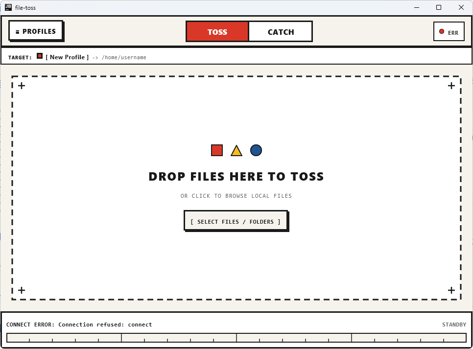
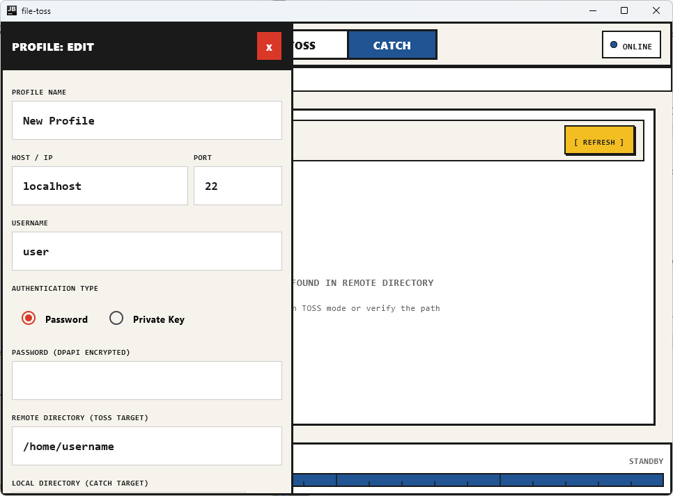

# file-toss

バウハウス様式の幾何学的デザインを備えた、直感的なファイル送受信デスクトップツール。

## 目次

1. [概要](#概要)
2. [開発フロー・背景](#開発フロー背景)
3. [仕組み](#仕組み)
4. [構造](#構造)
5. [実行方法](#実行方法)
6. [使い方](#使い方)
7. [設計のこだわり](#設計のこだわり)

## 概要

あらかじめ登録した接続先プロファイルに対し、ドラッグ＆ドロップで軽快にファイルを送信 (TOSS) し、リモートサーバーのファイルを一覧からワンクリックで受信 (CATCH) するWindows 11向けデスクトップアプリケーション。

| TOSS (ファイル送信待機画面) | PROFILE / CATCH (プロファイル編集画面) |
| :---: | :---: |
|  |  |

## 開発フロー・背景

- Antigravity にてペアプログラミング開発
- アイデア出しおよび `/grill-me` スキルによるインタラクティブな要件定義
- Kotlinがアツかったので使用
  Compose Multiplatform for Desktop と Kotlin 2.x を採用し、モダンなデスクトップGUI環境を構築

## 仕組み

Compose Multiplatform for Desktop (JVM) を採用し、クラシック・バウハウス様式の幾何学的グリッドとキネティック演出を実現。転送プロトコルは抽象化インターフェースを介して疎結合に設計され、MVPとしてSFTP (sshj) を実装している。また、接続先パスワードや秘密鍵パスフレーズは Windows DPAPI (Data Protection API) によりユーザーアカウント固有の鍵で自動暗号化して安全に保存される。

- 言語: Kotlin 2.1
- UIフレームワーク: Compose Multiplatform 1.7 (Desktop / Material 3)
- ビルドツール: Gradle 8.13 (Gradle Wrapper)
- 通信ライブラリ: sshj 0.39 (SFTP / SSH)
- セキュリティ: JNA (Windows DPAPI `CryptProtectData` / `CryptUnprotectData`)
- 非同期処理: Kotlinx Coroutines (Swing / Dispatchers.IO)
- 設定永続化: Kotlinx Serialization (JSON)

### 構造

```text
file-toss/
├── build.gradle.kts
├── settings.gradle.kts
├── gradlew
├── gradlew.bat
├── SPEC.md
├── README.md
├── .gitignore
├── docs/
│   └── images/
│       ├── screenshot-toss.png                        - TOSS 画面のスクリーンショット
│       └── screenshot-profile.png                     - プロファイル設定画面のスクリーンショット
├── gradle/
│   └── wrapper/
│       ├── gradle-wrapper.jar
│       └── gradle-wrapper.properties
└── src/
    ├── main/
    │   └── kotlin/com/filetoss/
    │       ├── Main.kt                                - アプリケーションエントリーポイントとAWT DnD連携
    │       ├── domain/
    │       │   ├── client/
    │       │   │   └── TransferClient.kt              - プロトコル中立の転送インターフェース
    │       │   ├── model/
    │       │   │   └── Models.kt                      - プロファイル、転送進捗、ファイル情報等のモデル定義
    │       │   └── usecase/
    │       │       └── UseCases.kt                    - TOSS/CATCH/ファイル一覧取得のユースケース
    │       ├── data/
    │       │   ├── repository/
    │       │   │   └── ProfileRepository.kt           - %APPDATA%/file-toss/profiles.json 永続化
    │       │   ├── security/
    │       │   │   └── CredentialStore.kt             - Windows DPAPI による資格情報暗号化・復号化
    │       │   └── sftp/
    │       │       └── SftpTransferClient.kt          - sshj を用いたSFTP接続・送受信実装
    │       └── ui/
    │           ├── components/
    │           │   ├── BauhausButton.kt               - 物理的沈み込み演出を持つ太枠ボタン
    │           │   ├── BauhausShapes.kt               - 十字レティクルや原色幾何学図形の描画
    │           │   ├── DropZoneComponent.kt           - ドラッグ＆ドロップ受付とキネティック演出
    │           │   ├── MechanicalProgressBar.kt       - 目盛り付きプログレスバー
    │           │   ├── ModeToggle.kt                  - TOSS/CATCH モード切替スライダー
    │           │   ├── ProfileSidebar.kt              - プロファイル管理・編集スライドインパネル
    │           │   └── RemoteBrowserComponent.kt      - CATCH用リモートファイル一覧カード
    │           ├── screens/
    │           │   └── MainScreen.kt                  - メイン画面レイアウト統合
    │           ├── theme/
    │           │   └── BauhausTheme.kt                - バウハウスカラーパレットとタイポグラフィ
    │           └── viewmodel/
    │               └── MainViewModel.kt               - アプリ状態管理と非同期転送制御
    └── test/
        └── kotlin/com/filetoss/
            ├── data/
            │   ├── repository/
            │   │   └── JsonProfileRepositoryTest.kt   - プロファイル保存・削除の単体テスト
            │   └── security/
            │       └── CredentialStoreTest.kt         - DPAPI暗号化・復号化のテスト
            └── domain/
                └── TransferProgressTest.kt            - 進捗率・バイト数フォーマット計算テスト
```

## 実行方法

| コマンド                   | 実行内容                                 |
| -------------------------- | ---------------------------------------- |
| `.\gradlew.bat run`        | アプリケーションの起動                   |
| `.\gradlew.bat test`       | 単体テストの実行                         |
| `.\gradlew.bat packageMsi` | Windows向けMSIインストーラーのビルド     |
| `.\gradlew.bat packageExe` | Windows向けEXE実行可能パッケージのビルド |

### WSL環境のプロジェクトをWindows側から実行する場合

プロジェクトがWSL内にある場合、Windows側のCMDやPowerShellから直接UNCパス (`\\wsl.localhost\...`) を指定すると、CMDのUNC制約やWSL共有ファイルシステムのキャッシュ制約が発生することがある。一時ドライブを割り当てる `pushd` と、ローカル側のキャッシュディレクトリ指定を併用して実行する。

```cmd
pushd \\wsl.localhost\<ディストリビューション名>\<リポジトリのパス>\file-toss
gradlew.bat run --project-cache-dir %USERPROFILE%\.gradle\file-toss-cache
popd
```

※ `JAVA_HOME is not set` エラーが表示される場合は、使用するJavaのインストール先を設定する。`gradlew.bat` は Android Studio 同梱の JBR などを自動検出するが、明示的に指定する場合は以下のように環境変数を設定してから実行する。

```cmd
set "JAVA_HOME=%ProgramFiles%\Android\Android Studio\jbr"
```

## 使い方

### 1. プロファイルの登録・切替

1. 画面左上の `[≡ PROFILES]` をクリックしてサイドバーを展開する
2. `+ ADD NEW PROFILE` をクリックし、ホスト名、ポート、ユーザー名、認証情報 (パスワードまたは秘密鍵)、リモート送信先パス、ローカル受信先パスを入力して `SAVE` を押す
3. 必要に応じて `TEST` を押すことで、即座に接続疎通を確認できる
4. 登録したプロファイルをクリックするとアクティブプロファイルが切り替わる

### 2. TOSS モード (送信)

1. 上部のモードスイッチで `TOSS` を選択する
2. Windows エクスプローラーから送りたいファイルまたはフォルダを中央のドロップゾーンにドラッグ＆ドロップする
3. ドラッグオーバー時に枠線がバウハウスレッドに反転し、ドロップと同時に自動的にリモートサーバーの宛先ディレクトリへアップロードされる (フォルダは再帰的に転送される)
4. 下部のメカニカルプログレスバーで転送進捗、転送速度 (MB/s)、進行率を確認できる
5. 転送が完了すると `TOSSED!` が表示される

### 3. CATCH モード (受信)

1. 上部のモードスイッチで `CATCH` を選択する
2. リモートサーバーのディレクトリ内にあるファイル一覧が幾何学カードとして表示される
3. 目的のファイルの `CATCH` ボタンをクリックすると、設定されたローカルディレクトリへダウンロードされる
4. フォルダカードの `OPEN DIR ->` をクリックするとそのディレクトリへ移動できる
5. 右上の `[ REFRESH ]` ボタンで最新状態に再取得できる

## 設計のこだわり

- **Form follows function (機能主義)**: 余計なグラデーションや装飾を排し、オフホワイト (`#F5F3EC`)、フレームブラック (`#1A1A1A`)、バウハウスレッド (`#D93829`)、コバルトブルー (`#205493`)、カドミウムイエロー (`#F3BE22`) の原色幾何学ブロックと力強いグリッド線で構成
- **メカニカルな触感演出**: ボタンのクリック時には4dpのソリッドシャドウに向かってボタン本体が物理的に沈み込むキレのあるスナップアニメーションを実装
- **セキュア・バイ・デフォルト**: パスワードや鍵のパスフレーズは平文では保存せず、Windows DPAPIを利用してOSレベルで暗号化して保存
